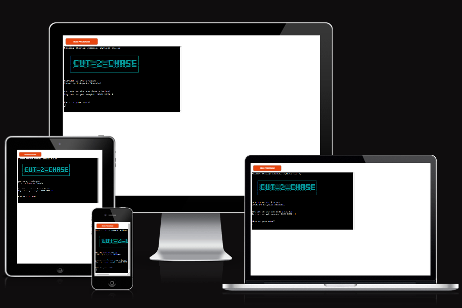

# CUT-2-CHASE

### Overview
'CUT-2-CHASE' is a Python terminal game where the word that has to be guessed is all about car brands worldwide. Similar to 'hangman', the player is presented with a series of underscores that represent a word. They must enter one letter at a time and guess the word to win the game. I love playing hangman games but I wanted to give my touch to the game. Hence, I came up with cut-2-chase. Backstory: The player is on the drive after a heist and a police car is chasing them. The player has to find the word before the police car catches up(this is represented on the terminal to have a better user experience.).

### - By Priyanka Dhanabal

The live version of the project can be viewed [here](https://cut-2-chase-pp3-fa8e87cba1b5.herokuapp.com/)

You can check out my Repository [here](https://github.com/Priyanka-Dhanabal/cut-2-chase-pp3)

## Table of contents
 1. [ UX ](#ux)
	- [Site Goal](#site-goal)
	- [User Stories](#user-stories)
	- [Flowcharts](#flowcharts)
 2. [ Features ](#features)
 3. [ Future Feature ](#future-features)
 4. [ Technology used ](#technologies-used)
 5. [ Testing ](#testing)
	 - [Manual Testing](#manual-testing)
	 - [Validations](#validations)
 6. [ Bugs ](#bugs)
 7. [ Deployment](#deployment)
 8. [ Citation of Sources](#credits)

## UX

### Site Goal
To provide a simple and fun platform where the player can try to guess a car brand. The car brand word is chosen at random by the computer.

### User Stories
#### As a User:
- I want to be able to start and view the game instructions.
- I want to be able to view the number of letters as an underscore and be able to view the output of my choice.
- I want to be able to view information like letters already typed in.
- I want to be able to play again once I finish the game.
#### As the site administrator:
- I want to be able to build an easy app for the players to play a game.
- I want to be able to provide the necessary message for the player on every user input.

### Design

- **Colorama.Fore** used to have colored text on the terminal.
I was inspired while referring through many pp3 projects. I immediately knew, I had to add this feature to my program and did some research on the same, making my program have a better user experience.

### Flowcharts

I used flowchart to plan out the code.

[Back to top](#table-of-contents)

## Features

- At the start of the game - Welcomes the player and request the player's name.

- Ask if the player wants to read the rules. Displays the message respectively.

- Players can clear the screen before the game starts.

- There are 5 attempts in total.

- Initially game displays a Car and hidden word in the form of underscores.

- If the letter is typed and the letter is in the hidden word, the hidden word is updated and displayed.

- Along with the hidden word, guessed letters are displayed and the number of remaining attempts is displayed.

- If the letter is not in the word or if the letter is repeated, the number of attempts is reduced by 1 and the next stage is shown with all the updated details.

- When the number of remaining attempts becomes zero, the game ends displaying the text you lost in ASCII art with the hidden letter.

- If player have found the word, game ends displaying the text you Win in ASCII art with the hidden letter.

- players can choose to play again or quit.

## Future Features
Due to time constraints, I wasn't able to add these features, but I would like to in the future.

- A score board.
- An ability to guess the whole word, if the player knows it.

[Back to top](#table-of-contents)

## Technologies Used

- **Git** Used to version control throughout my project and to ensure that a clean record is maintained.
- **GitHub**  Used to store the project's code after being pushed from Git
- **Heroku** Used to deploy the live project
- **GitPod** Used as an Integrated Development Environment for building this website.

 **Languages Used**
- Python

**Python Packages/ Libraries Used**
I used the following libraries and modules:
- Random: (choice) returns a random word from a list of words.
- Time: defined time sleep
- Colorama: (Fore) to apply different color to texts
- Sys

[Back to top](#table-of-contents)

## Testing

I have been testing the code many times in my local terminal and on the Heroku site.

| Input  | Status |
|--|--|
|player receiving a response if Name was not valid.| True |
|If a player chooses not to give a name, the default name has been taken| True |
|player can choose if rules are to be viewed or not | True |
|Game instructions are displayed or skipped with respective to player choice  | True |
|Game instructions are displayed or skipped with respective to player choice  | True |
|player receives all necessary information while playing the game | True |
|player can view result - Won / Lost and the secret word | True |
|player can play again | True |
|player can Quit the game| True |

- When a number or word with special characters is given, It is invalid.
- When player simply does not wish to give a name, then Champ is taken as default name.

- when player gives any input apart from y or n, player is prompted with invaide choice.

- The player can input only one alphabet at a time. If any number, special characters, more that 1 letter or enter without any input, player receives a prompt stating that "Only one letter is allowed to be entered.
It must be an alphabet or '-', Try again !"

- Some Car brands are made of two words so, "-" is placed between them.

- When player gives any input apart from y or n, player is prompted with invaide choice.

- When the player gives N for play again, the game ends.

#### Validations

Used [CI Python Linter](https://pep8ci.herokuapp.com/) to validate if all the Python files follow the PEP8 style guide. 

No errors were found.

[Back to top](#table-of-contents)

## Bugs

### Solved bugs:
1. During the development phase of my project, when I applied an ascii art for my logo, I kept receiving errors for using an escape sequence. Later I was advised to use [python-raw-string](https://www.digitalocean.com/community/tutorials/python-raw-string). It was helpful as I learned something new that was not taught in the CI Python module. 

2. I ran the code on CI Python Linter tool and corrected it as per the PEP8 style guide.

3. The content in the terminal was getting cleared in my local gitpod terminal but not on Heroku site when clear_screen function was called, that consisted os.system('clear). I tried cls instead of clear but it did not work. On approaching the tutor support I found out that you can do this in many ways. By providing a print statement such as print("\033c"). I referred Stackover flow website and I found another way that I have used in my project that is, 
sys.stdout.write("\033c")
sys.stdout.flush() 
This resolved the issue.

### Unfixed Bugs:
No known bugs.

[Back to top](#table-of-contents)

## Deployment

This project is deployed on Heroku.

1. Login to [Heroku](https://id.heroku.com/login) or create a account.
2. On the main page, click the button labeled as New and from the drop-down menu select create New App.
3. Please enter a unique app name.
4. Select your region and click on Create App button
5. Within your page, navigate to settings tab
6. Scroll down to view the Config Vars section and click Reveal Config Vars.
7. Enter port into the Key box and 8000 into the Value box and click the Add button.
8. Next, scroll down to Buildpacks sections. Click Add buildpack and select python.
9. Within the same section, click Add buildpack and select nodejs. Note it has to be in order, first will be pytho and then nodejs.
10. Scroll up and navigate to Deploy tab.
11. Select Github as the deployment method
12. Search for the repository name and click the connect button
13. Scroll to the bottom of the deploy page and select the preferred deployment type
14. Click either Enable Automatic Deploys for automatic deployment when you push updates to Github or Manual deploy to deploy the current state of the branch you choose. I have used the manual method.

[Back to top](#table-of-contents)

## Credits
### Content and resources
1. Code Institute
	- Course content for the portfolio project3 helped greatly in understanding the need to complete the project.
	- The Love Sandwich project helped me understand various requirements from python point of view.
2. W3 School
	- Used to reference python related methods.
3. stackoverflow
	- Used to refer some python related workaround.
3. Lucidchart
	- used to create a flow chart to illustrate my project idea.
4. ChatGPT
	- To generate 50 car brands worldwide.
5. StackEdit
    - To edit my readMe file content.
7. ASCII art websites to generate the logo and stages.
8. Slack channels
9. Freecodecamp youtube channel - to refer python related methods.

### Acknowledgements

Mentor - Akshat_Garg
- My Mentor provided feedback and guidance throughout.

Kristyna - Cohort facilitator
- She was very helpful in making me understand the various requirements to achieve a good project.

Code Institute Tutor Support team
- The Tutor support team was always available to answer my questions. It is great to have this team as I was able to get few issues resolved.

My Spouse and myself
- I would like to acknowledge myself and my spouse. My spouse was very supportive and I am proud of myself that I was able to build a functional project within a short period of time.

*****************
[Back to top](#table-of-contents)
